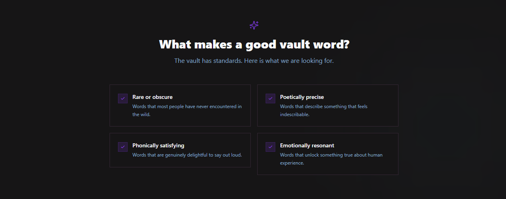

# notes

## todo list - personal

// not in order, just reminders //

### necessary fixes

- workshop individual games names and games pages
  - write 'How to Play' instructions for each game
  - create games pages and leaderboards
- Fix background on About Page (photo position)
- Remove from about page: "Part werd-hoard, part playground, part love letter to language.
  The useful kind of nerdy: obscure enough to sparkle, clear enough to share."
- Revise/write FAQs for About Page
- add Chrome Sky gradient to Submit Werd and double check Chrome Sky matches intended vision [sky depth effect reference](../public/reference/sky%20depth%20effect.mp4)
- Check/Revise wording on all texts
- Change Heading Font kalina/georgia
- Fix Spin the Vault to match the intended design
  - animated _minimal_ slot style
- Fix chunks size error. Consider:
  - Using dynamic import() to code-split the application
  - Use build.rolldownOptions.output.codeSplitting to improve chunking: [Rolldown code-splitting options](https://rolldown.rs/reference/OutputOptions.codeSplitting)
  - Adjust chunk size limit for this warning via build.chunkSizeWarningLimit.
- design user profile page and implement profile data flow
- design user setting page and implement settings data flow
- adjust spacing on HomePage
- Add real links to social media icons in the footer
- workshop the werdnerd logo and favicon (build a brand identity)
- adjust colors/readability of tags in QuickBrowse
- adjust CuratedPicks wording and design to illustrate the intent of the feature, 6 werds personally picked by the auther
  - change wording to "The Curious Collection"
  - make cards smaller, to minimize scrolling
- verify all werds tags
- remove werd count from vault hero
- add Home to menu for all pages except Home
- add scroll to top button on all long pages
- fix guidelines section on Submit Werd page to match intended design 
- fix log in page spacing and design

### proposed, open to honest feedback

- add Brain Teasers to the Games Page
- add a bolder rainbow chrome accent/hover effect/etc to each CuratedPickscard
- add a "See More" button to werd cards in CuratedPicks to link to individual werd card module, and a browse full vault button at the bottom of the section to link to the full vault page
- add parallax background to Werd Vault Page
- add some kind of fun but on brand animation or reveal effect to the ffotd (fun fact of the day)
- add rainbow chrome hover effect to footer links (if it works with the footer design)
- brainstorm a more aesthetic vault layout
- change werd vault design to feel more like a digital book shelf
- (**create werdnerd social media accounts??**)
  - insta
  - (twitter)
  - (facebook)
  - (tiktok)
  - (pinterest)
- add light/dark mode lightswitch style toggle in user settings page
- workshop and reimplement Creator's Playground Page
- create a werdnerd email and/or text number / ai chatbot for user feedback and support

---

## content ideas

### possible taglines

#### general

- “Some people doomscroll. You verdwell.”
- “Rare words. Weird etymologies. Productive procrastination.”
- “Built for people who’ve ever stopped mid-sentence to admire a single perfect werd.”
- “The internet’s coziest trapdoor into strange vocabulary.”
- “Words worth hoarding.”
- A living vault of rare, poetic, and peculiar vocabulary for people who know a good werd can ruin a perfectly productive afternoon.

#### vault

- “A vault of strange, beautiful, and dangerously distracting words.”
- “An archive of rare vocabulary, intriguing oddities, and games fit for a werd nerd.”
- “A living lexicon of peculiar words, verbal artifacts, and linguistic treasures.”
- Explore rare, obscure, and interesting words curated just for you

#### home page sections

- A teaser of weird and wonderful terms waiting for you.

##### curated

- “A curated vault for the logophile, the quirky, and the unusual.”
- “The Curious Collection”

#### about page

##### contact us

- Have a question or suggestion?

#### submit werd page

- Found a rare gem? Share it with the vault.
- contribute

#### creators playground

- Exploring vibrant foregrounds and high-contrast typography in the dark. A collection of fun, unusual English words styled for maximum impact.

#### games

Boggle Pro
Trivia Night
Fun Facts

#### footer

Archive
Resources
API Docs
Community
Creator Tools
Suggest

API Access
Integrate WerdNerd into your projects.

Collaborate
Join our linguistic research team.

Feedback
Help us improve the WerdNerd hub.

##### newsletter

Get a [daily dose] of [linguistic levity] sent to your inbox

##### copyright

2026 WerdNerd. Built with TypeScript & Curiosity.

---

### terminology

- obsession

#### archive

- collection
- werd-cabinet
- archive
- Lexicon
- dictionary
- "a lexical resource"

#### the audience

- logophiles
- language nerds
- rabbit-hole divers
- incurably curious
- werd-hoard

#### werd

- "Slang"
- turn of phrase
- "Vocab"
- "Talk"
- "Terminology"
- "Nomenclature"
- "terms"
- "Vocabulary"
- "Verbiage"
- "wording"
- "language"
- "Phrasing"
- "sentences"
- "expressions"
- "Diction"
- "speech"
- "Vernacular"
- "dialect"
- "Idiom"
- "phrase"
- "literal"
- "vocable"
- "utterances"
- "linguistics"
- "literary"
- "locution"
- "lexeme"
- cant
- parlance
- jargon
- lingo
